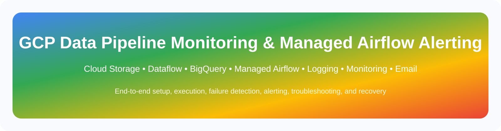
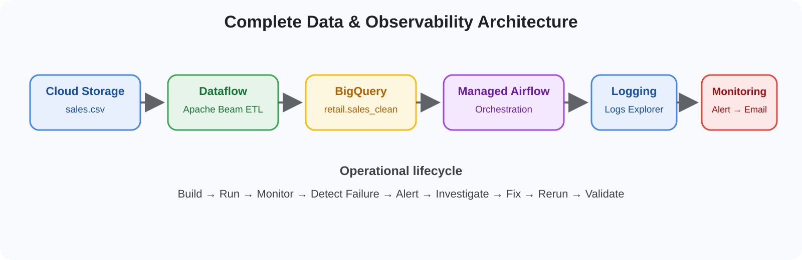
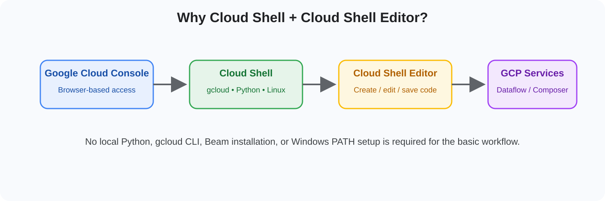
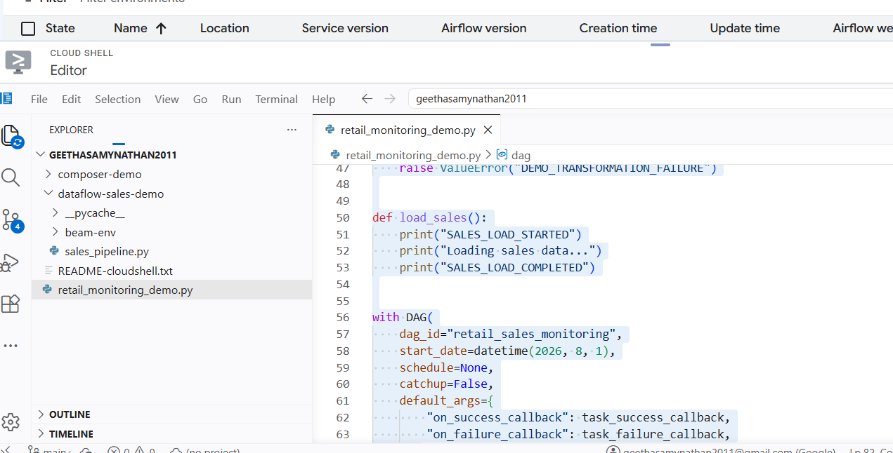
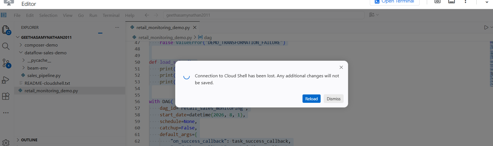
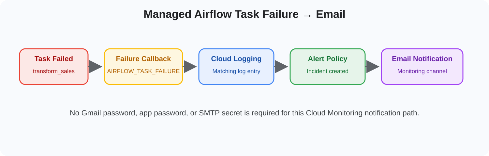

# 🌐 GCP Data Pipeline Monitoring, Managed Airflow Failure Alerting & Email Notification

> [!IMPORTANT]
> **How to view this Markdown correctly:** Do **not** double-click the `.md` file and open it directly in Chrome/Edge. A browser normally displays Markdown as plain text, which is why backticks such as ` ```bash ` were visible in the screenshot.
>
> Use one of these options:
> - **VS Code:** open the `.md` file and press **Ctrl + Shift + V**
> - **VS Code:** right-click the file → **Open Preview**
> - **GitHub/GitLab:** upload the Markdown file and open it there
> - For a browser-ready version, open the included **HTML** file instead.

> **Purpose:** A complete step-by-step reference covering Cloud Storage, BigQuery, Dataflow, Cloud Shell, Cloud Shell Editor, Managed Airflow, Cloud Logging, Cloud Monitoring, task failure detection, alerting, troubleshooting, fix, rerun, and validation.

---

## 📑 Table of Contents

1. [What is being built](#1-what-is-being-built)
2. [Why Cloud Shell is used](#2-why-cloud-shell-is-used)
3. [Why use Cloud Shell Editor?](#3-why-use-cloud-shell-editor)
4. [Cloud Shell connection warning](#4-important-cloud-shell-connection-warning)
5. [Project and APIs](#-part-a--project-and-apis)
6. [Cloud Storage](#-part-b--cloud-storage)
7. [BigQuery](#-part-c--bigquery)
8. [Dataflow Development](#-part-d--dataflow-development)
9. [Managed Airflow](#-part-e--managed-airflow)
10. [Create the Airflow DAG](#-part-f--create-the-managed-airflow-dag)
11. [Generate a failure](#-part-g--generate-a-failure)
12. [Verify Cloud Logging](#-part-h--verify-cloud-logging)
13. [Configure Email Notification](#-part-i--configure-email-notification)
14. [Create the Task Failure Alert](#-part-j--create-the-task-failure-alert)
15. [Optional Log-Based Metric](#-part-k--optional-log-based-metric)
16. [Fix and Rerun](#-part-l--fix-and-rerun)
17. [Troubleshooting](#-part-m--troubleshooting)
18. [Final Architecture](#-part-n--final-architecture)
19. [Final Validation Checklist](#-final-validation-checklist)

---

## 1. What is being built

The complete flow is:



```text
                    GCP DATA PIPELINE
                           │
                           ▼
                    Cloud Storage
                    input/sales.csv
                           │
                           ▼
                       Dataflow
                    Apache Beam ETL
                           │
                           ▼
                       BigQuery
                  retail.sales_clean


                  WORKFLOW / ORCHESTRATION
                           │
                           ▼
                    Managed Airflow
                     retail-airflow
                           │
                           ▼
                retail_sales_monitoring
                           │
              ┌────────────┼────────────┐
              ▼            ▼            ▼
           extract      transform       load
                         FAILED
                           │
                           ▼
                 AIRFLOW_TASK_FAILURE
                           │
                           ▼
                     Cloud Logging
                           │
                           ▼
                   Log-based Alert
                           │
                           ▼
                   Cloud Monitoring
                           │
                           ▼
                       Incident
                           │
                           ▼
                  Email Notification
```

Managed Airflow integrates with Cloud Logging and Cloud Monitoring, so task execution, task failures, scheduler information, worker information, and environment health can be monitored centrally.

---

# 🟩 2. Why Cloud Shell is used

> 💡 **Cloud Shell = a ready-to-use Google Cloud workstation inside the browser.**  
> It is mainly used here to run `gcloud` commands, create Python virtual environments, install Apache Beam, validate files, submit Dataflow jobs, and upload DAG files to Managed Airflow.


Most resources are created through the **Google Cloud Console**, such as:

```text
Cloud Storage
BigQuery
Dataflow Jobs view
Managed Airflow environment
Cloud Logging
Cloud Monitoring
Alerting
```

Cloud Shell is used where commands and Python development make the workflow easier.

## What is Cloud Shell?

Cloud Shell is a browser-based Linux environment provided inside Google Cloud.

Open it from the top-right of the Google Cloud Console:

```text
>_ Activate Cloud Shell
```

It gives access to:

```text
Linux terminal
Python
pip
gcloud CLI
Google Cloud authentication
Current GCP project
Cloud Storage commands
Composer commands
```

The Dataflow setup uses Cloud Shell so Apache Beam and the Google Cloud SDK do not have to be installed and configured on a local Windows machine.

### Why this is useful

Without Cloud Shell, the local machine would need:

```text
Python
pip
Apache Beam
Google Cloud CLI
gcloud authentication
Application Default Credentials
PATH configuration
```

Cloud Shell removes most of that setup.



---

# 🟨 3. Why use Cloud Shell Editor?

> ✍️ **Cloud Shell Editor is for editing code; Cloud Shell Terminal is for running commands.**  
> Both operate inside Google Cloud, so the workflow can be completed without installing a local development environment.


The terminal is excellent for commands.

The **Cloud Shell Editor** is useful for creating and editing Python files.

From Cloud Shell:

```text
Open Editor
```

The Editor behaves similarly to VS Code.

Files can be created such as:

```text
sales_pipeline.py
retail_monitoring_demo.py
```

The Dataflow portion uses **Open Editor → File → New File → sales_pipeline.py** rather than requiring a local IDE.

The Managed Airflow portion similarly uses Cloud Shell Editor to create `retail_monitoring_demo.py`.

### Very important distinction

When this is done:

```text
Ctrl + S
```

the file is saved only in the **Cloud Shell filesystem**.

It is **not automatically copied into Managed Airflow**.

The process is:

```text
Cloud Shell Editor
        │
        │ Ctrl + S
        ▼
Cloud Shell filesystem
        │
        │ gcloud composer ... import
        ▼
Composer Cloud Storage /dags
        │
        │ automatic synchronization
        ▼
Managed Airflow
        │
        ▼
Airflow DAG
```

Saving a Python file in Cloud Shell Editor does not automatically update Managed Airflow. The file first has to reach the environment's `dags` folder.

### Cloud Shell Editor example



---

# 🟥 4. Important Cloud Shell connection warning

> ⚠️ **If the Cloud Shell connection is lost, stop editing immediately.**  
> Changes typed after the connection is lost might not be saved.


The following message means the Editor has lost its active connection:

> **Connection to Cloud Shell has been lost. Any additional changes will not be saved.**



When this message appears, do **not continue editing**.

Click:

```text
Reload
```

Reconnect Cloud Shell.

Then reopen the file and confirm that the latest code is still present.

Save again:

```text
Ctrl + S
```

Only after that should the DAG be uploaded to Managed Airflow.

---

# 🟦 PART A — Project and APIs

## 5. Select the GCP project

At the top of the Console, select the required project.

From Cloud Shell verify it:

```bash
gcloud config get-value project
```

Store it:

```bash
PROJECT_ID=$(gcloud config get-value project)
```

Check:

```bash
echo $PROJECT_ID
```

---

# 🟪 6. Enable required APIs

Navigate:

```text
☰ Navigation menu
→ APIs & Services
→ Library
```

Enable:

```text
Dataflow API
Cloud Composer / Managed Airflow API
Cloud Logging API
Cloud Monitoring API
BigQuery API
Cloud Storage API
Compute Engine API
```

For the email-alert method being used here:

```text
Gmail API      ❌ Not required
SMTP           ❌ Not required
Gmail password ❌ Not required
App password   ❌ Not required
```

Cloud Monitoring sends the notification.

---

# 🟨 PART B — Cloud Storage

## 7. Create a bucket

Navigate:

```text
☰
→ Cloud Storage
→ Buckets
→ CREATE
```

Create a bucket.

Example:

```text
YOUR_PROJECT_ID-sales-data
```

Region:

```text
us-central1
```

---

# 🟧 8. Create folders

Inside the bucket create:

```text
input/
temp/
staging/
```

Result:

```text
bucket
│
├── input/
│   └── sales.csv
│
├── temp/
│
└── staging/
```

---

# 🟩 9. Create `sales.csv`

Use:

```csv
order_id,customer_id,product,category,quantity,price
1001,C001,Laptop,Electronics,1,900
1002,C002,Mouse,Electronics,2,25
1003,C003,Chair,Furniture,1,150
1004,C004,Keyboard,Electronics,1,70
1005,C005,Desk,Furniture,1,300
1006,C006,Monitor,Electronics,2,220
1007,C007,Notebook,Stationery,5,4
1008,C008,Pen,Stationery,10,2
1009,C009,Headphones,Electronics,1,80
1010,C010,Printer,Electronics,1,240
```

Upload it to:

```text
input/
```

---

# 🟦 PART C — BigQuery

## 10. Create dataset

Navigate:

```text
☰
→ BigQuery
→ BigQuery Studio
```

Select the project.

Choose:

```text
⋮
→ Create dataset
```

Dataset ID:

```text
retail
```

---

# 🟪 11. Create destination table

Run:

```sql
CREATE TABLE IF NOT EXISTS `YOUR_PROJECT_ID.retail.sales_clean`
(
    order_id STRING,
    customer_id STRING,
    product STRING,
    category STRING,
    quantity INT64,
    price FLOAT64,
    total_amount FLOAT64
);
```

The pipeline calculates:

```text
total_amount = quantity × price
```

Example:

```text
Mouse

quantity = 2
price    = 25

total_amount = 50
```

---

# 🟩 PART D — Dataflow Development

## 12. Open Cloud Shell

Click:

```text
>_ Activate Cloud Shell
```

Create a working directory:

```bash
mkdir -p ~/dataflow-sales-demo
cd ~/dataflow-sales-demo
```

---

# 🟨 13. Create a Python virtual environment

```bash
python3 -m venv beam-env
```

Activate:

```bash
source beam-env/bin/activate
```

The prompt should show something similar to:

```text
(beam-env)
```

---

# 🟧 14. Install Apache Beam

```bash
pip install --upgrade pip
```

Then:

```bash
pip install "apache-beam[gcp]"
```

Verify:

```bash
python -c "import apache_beam as beam; print(beam.__version__)"
```

---

# 🟦 15. Open Cloud Shell Editor

Click:

```text
Open Editor
```

Create:

```text
dataflow-sales-demo/
    sales_pipeline.py
```

Use:

```python
import argparse
import logging
import apache_beam as beam
from apache_beam.options.pipeline_options import PipelineOptions


class ParseSalesRecord(beam.DoFn):

    def process(self, element):
        try:
            fields = element.split(",")

            quantity = int(fields[4])
            price = float(fields[5])

            total_amount = quantity * price

            yield {
                "order_id": fields[0],
                "customer_id": fields[1],
                "product": fields[2],
                "category": fields[3],
                "quantity": quantity,
                "price": price,
                "total_amount": total_amount
            }

        except Exception as e:
            logging.error(
                "SALES_PIPELINE_RECORD_ERROR: %s | RECORD=%s",
                str(e),
                element
            )
            raise


def run():

    parser = argparse.ArgumentParser()

    parser.add_argument("--input", required=True)
    parser.add_argument("--output_table", required=True)

    args, beam_args = parser.parse_known_args()

    options = PipelineOptions(beam_args)

    logging.info("SALES_PIPELINE_STARTED")

    with beam.Pipeline(options=options) as pipeline:

        (
            pipeline

            | "Read Sales File"
            >> beam.io.ReadFromText(
                args.input,
                skip_header_lines=1
            )

            | "Parse Records"
            >> beam.ParDo(ParseSalesRecord())

            | "Write BigQuery"
            >> beam.io.WriteToBigQuery(
                args.output_table,
                write_disposition=
                    beam.io.BigQueryDisposition.WRITE_APPEND,
                create_disposition=
                    beam.io.BigQueryDisposition.CREATE_NEVER
            )
        )

    logging.info("SALES_PIPELINE_COMPLETED")


if __name__ == "__main__":
    logging.getLogger().setLevel(logging.INFO)
    run()
```

The pipeline is:

```text
Read CSV
   ↓
Skip header
   ↓
Parse fields
   ↓
Convert quantity and price
   ↓
Calculate total_amount
   ↓
Write BigQuery
```

---

# 🟪 16. Save the Python file

Use:

```text
Ctrl + S
```

Before Dataflow submission, validate the Python syntax:

```bash
python -m py_compile sales_pipeline.py
```

No output means the syntax check succeeded.

---

# 🟨 17. Configure variables

```bash
PROJECT_ID=$(gcloud config get-value project)
```

Set the bucket:

```bash
BUCKET="YOUR_BUCKET_NAME"
```

Verify:

```bash
echo $PROJECT_ID
echo $BUCKET
```

Check the input:

```bash
gcloud storage ls gs://$BUCKET/input/
```

Inspect it:

```bash
gcloud storage cat gs://$BUCKET/input/sales.csv
```

---

# 🟥 18. Submit the Dataflow job

Run:

```bash
python sales_pipeline.py \
  --runner=DataflowRunner \
  --project=$PROJECT_ID \
  --region=us-central1 \
  --input=gs://$BUCKET/input/sales.csv \
  --output_table=$PROJECT_ID:retail.sales_clean \
  --temp_location=gs://$BUCKET/temp \
  --staging_location=gs://$BUCKET/staging \
  --job_name=retail-sales-pipeline
```

The important setting is:

```text
--runner=DataflowRunner
```

It means:

```text
Cloud Shell
    │
    │ submits pipeline
    ▼
Dataflow
    │
    │ creates managed workers
    ▼
Processes data
```

Cloud Shell is only the **submission environment**; Dataflow workers perform the actual processing.

---

# 🟩 19. Verify Dataflow

Navigate:

```text
Google Cloud Console
→ Dataflow
→ Jobs
```

Open:

```text
retail-sales-pipeline
```

Expected:

```text
Read Sales File
       ↓
Parse Records
       ↓
Write BigQuery
```

Job status should eventually be:

```text
Succeeded / Done
```

---

# 🟦 20. Verify BigQuery

Navigate:

```text
BigQuery
→ retail
→ sales_clean
→ Preview
```

Or run:

```sql
SELECT *
FROM `YOUR_PROJECT_ID.retail.sales_clean`
ORDER BY order_id;
```

Expected examples:

```text
Laptop    1 × 900 = 900
Mouse     2 × 25  = 50
Monitor   2 × 220 = 440
Notebook  5 × 4   = 20
```

---

# 🟪 PART E — Managed Airflow

## 21. Create the Composer service account

Navigate:

```text
☰
→ IAM & Admin
→ Service Accounts
→ CREATE SERVICE ACCOUNT
```

Name:

```text
composer-retail-sa
```

Grant:

```text
Cloud Composer
→ Composer Worker
```

Role:

```text
roles/composer.worker
```

---

# 🟨 22. Create Managed Airflow environment

Navigate:

```text
Managed Airflow
→ Environments
→ Create
```

Example configuration:

```text
Name            : retail-airflow
Location        : us-central1
Service version : Gen 3
Airflow         : available 2.x version
Service account : composer-retail-sa
Resilience      : Standard
Size            : Small
```

Click:

```text
CREATE
```

Wait for the environment to become healthy.

---

# 🟧 PART F — Create the Managed Airflow DAG

## 23. Create a Cloud Shell folder

Open Cloud Shell:

```bash
mkdir -p ~/composer-demo
cd ~/composer-demo
```

Open:

```text
Cloud Shell
→ Open Editor
```

Create:

```text
retail_monitoring_demo.py
```

---

# 🟥 24. Use the failure-monitoring DAG

```python
from airflow import DAG
from airflow.operators.python import PythonOperator
from datetime import datetime
import logging


def task_success_callback(context):

    task_instance = context["task_instance"]

    logging.info(
        f"AIRFLOW_TASK_SUCCESS "
        f"dag_id={context['dag'].dag_id} "
        f"task_id={task_instance.task_id} "
        f"run_id={context.get('run_id')}"
    )


def task_failure_callback(context):

    task_instance = context["task_instance"]

    dag_id = context["dag"].dag_id
    task_id = task_instance.task_id
    run_id = context.get("run_id")
    exception = context.get("exception")

    logging.error(
        f"AIRFLOW_TASK_FAILURE "
        f"dag_id={dag_id} "
        f"task_id={task_id} "
        f"run_id={run_id} "
        f"error={exception}"
    )


def extract_sales():

    print("SALES_EXTRACT_STARTED")
    print("Reading sales file...")
    print("SALES_EXTRACT_COMPLETED")


def transform_sales():

    print("SALES_TRANSFORMATION_STARTED")
    print("Transforming sales data...")

    # Intentional failure
    raise ValueError("DEMO_TRANSFORMATION_FAILURE")


def load_sales():

    print("SALES_LOAD_STARTED")
    print("Loading sales data...")
    print("SALES_LOAD_COMPLETED")


with DAG(
    dag_id="retail_sales_monitoring",
    start_date=datetime(2026, 8, 1),
    schedule=None,
    catchup=False,
    default_args={
        "on_success_callback": task_success_callback,
        "on_failure_callback": task_failure_callback,
    },
) as dag:

    extract = PythonOperator(
        task_id="extract_sales",
        python_callable=extract_sales
    )

    transform = PythonOperator(
        task_id="transform_sales",
        python_callable=transform_sales
    )

    load = PythonOperator(
        task_id="load_sales",
        python_callable=load_sales
    )

    extract >> transform >> load
```

The failure callback writes a unique `AIRFLOW_TASK_FAILURE` log entry that Cloud Logging can detect.

---

# 🟩 25. Save the DAG

Press:

```text
Ctrl + S
```

Again:

> `Ctrl + S` saves only into Cloud Shell.

---

# 🟦 26. Upload the DAG to Managed Airflow

In Cloud Shell:

```bash
cd ~/composer-demo
```

Verify:

```bash
ls
```

Expected:

```text
retail_monitoring_demo.py
```

Upload:

```bash
gcloud composer environments storage dags import \
  --environment=retail-airflow \
  --location=us-central1 \
  --source=retail_monitoring_demo.py
```

Managed Airflow loads DAG Python files from its environment `/dags` location.

---

# 🟪 27. Verify the actual Composer DAG folder

Run:

```bash
gcloud composer environments describe retail-airflow \
  --location=us-central1 \
  --format="get(config.dagGcsPrefix)"
```

Store it:

```bash
DAG_FOLDER=$(gcloud composer environments describe retail-airflow \
  --location=us-central1 \
  --format="get(config.dagGcsPrefix)")
```

Check:

```bash
echo $DAG_FOLDER
```

---

# 🟨 28. Verify the uploaded DAG

```bash
gcloud storage ls -l "$DAG_FOLDER/retail_monitoring_demo.py"
```

Now check that the actual Composer copy contains the new failure callback:

```bash
gcloud storage cat "$DAG_FOLDER/retail_monitoring_demo.py" \
  | grep -n "AIRFLOW_TASK_FAILURE"
```

Expected:

```text
AIRFLOW_TASK_FAILURE
```

---

# 🟧 29. Check DAG import errors

Run:

```bash
gcloud composer environments run retail-airflow \
  --location=us-central1 \
  dags list-import-errors
```

If there is no syntax/import problem, no relevant error should be listed.

---

# 🟩 30. Wait for synchronization

The flow is:

```text
DAG file uploaded
      ↓
Composer bucket
      ↓
DAG processor
      ↓
Airflow parses Python
      ↓
Airflow UI updated
```

The DAG may not appear immediately because Managed Airflow has to synchronize and parse the file.

---

# 🟦 31. Verify in Airflow UI

Navigate:

```text
Managed Airflow
→ Environments
→ retail-airflow
→ Airflow webserver
```

Then:

```text
DAGs
→ retail_sales_monitoring
→ Code
```

Hard refresh if required:

```text
Ctrl + Shift + R
```

Search for:

```text
AIRFLOW_TASK_FAILURE
```

Do not trigger the DAG until the **Code** tab shows the updated code.

### Example Cloud Shell Editor view


---

# 🟥 PART G — Generate a Failure

## 32. Trigger a new DAG run

Click:

```text
Trigger DAG ▶
```

Expected:

```text
extract_sales
     │
     ▼
   SUCCESS
     │
     ▼
transform_sales
     │
     ▼
   FAILED
     │
     X
load_sales
UPSTREAM_FAILED
```

The controlled failure comes from:

```python
raise ValueError("DEMO_TRANSFORMATION_FAILURE")
```

The failure callback writes:

```text
AIRFLOW_TASK_FAILURE
dag_id=retail_sales_monitoring
task_id=transform_sales
run_id=...
error=DEMO_TRANSFORMATION_FAILURE
```

---

# 🟦 PART H — Verify Cloud Logging

## 33. Open Logs Explorer

Navigate:

```text
☰
→ Logging
→ Logs Explorer
```

Start with:

```text
"AIRFLOW_TASK_FAILURE"
```

Click:

```text
Run query
```

If necessary, make it more specific:

```text
resource.type="cloud_composer_environment"
"AIRFLOW_TASK_FAILURE"
```

Or:

```text
resource.type="cloud_composer_environment"
"AIRFLOW_TASK_FAILURE"
"dag_id=retail_sales_monitoring"
```

First make sure a matching log actually appears.

---

# 🟪 PART I — Configure Email Notification

## 34. Open Cloud Monitoring

Navigate:

```text
☰
→ Monitoring
→ Alerting
```

Select:

```text
Edit notification channels
```

Under:

```text
Email
```

click:

```text
ADD NEW
```

Enter the required notification address.

Example display name:

```text
Airflow Failure Alerts
```

Save.

No Gmail password is required.

---

# 🟥 PART J — Create the Task Failure Alert



## 35. Return to Logs Explorer

Use:

```text
resource.type="cloud_composer_environment"
"AIRFLOW_TASK_FAILURE"
"dag_id=retail_sales_monitoring"
```

Confirm at least one matching result.

Then click:

```text
Create alert
```

If it is not directly visible, check:

```text
Actions
```

or:

```text
⋮
```

---

# 🟨 36. Configure the alert

Example:

```text
Alert name:
Retail Airflow Task Failure
```

Severity:

```text
Critical
```

Minimum notification interval:

```text
5 minutes
```

Notification channel:

```text
Airflow Failure Alerts
```

Documentation:

```text
The retail_sales_monitoring DAG generated a task failure.

Open Managed Airflow → Airflow UI → retail_sales_monitoring
and inspect the failed task log.
```

Create/save the alert.

---

# 🟩 37. Test the full notification

Trigger another **new** DAG run.

Expected sequence:

```text
transform_sales
      ↓
FAILED
      ↓
task_failure_callback()
      ↓
logging.error()
      ↓
AIRFLOW_TASK_FAILURE
      ↓
Cloud Logging
      ↓
Log-based Alert Policy
      ↓
Cloud Monitoring
      ↓
Incident
      ↓
Email
```

Check:

```text
Monitoring
→ Alerting
→ Incidents
```

Then check the configured inbox.

The email is produced by **Cloud Monitoring**, not by Airflow's `send_email()`.

---

# 🟦 PART K — Optional Log-Based Metric

There are two valid approaches.

For the actual requirement:

> Notify when a specific Airflow task failure occurs.

the simpler path is:

```text
Log
→ Direct log-based alert
→ Email
```

However, if log-based metrics also need to be used, use:

```text
AIRFLOW_TASK_FAILURE
        ↓
Log-based Counter Metric
        ↓
failure_count
        ↓
Cloud Monitoring
        ↓
Alert
```

## 38. Create a log-based metric

Navigate:

```text
Logging
→ Log-based Metrics
→ CREATE METRIC
```

Choose:

```text
Counter
```

Example name:

```text
airflow_task_failure_count
```

Filter:

```text
resource.type="cloud_composer_environment"
"AIRFLOW_TASK_FAILURE"
```

Create the metric.

### When to use which?

| Requirement | Better approach |
|---|---|
| Notify whenever a specific failure occurs | **Direct log-based alert** |
| Count failures | **Log-based metric** |
| Graph failure trends | **Log-based metric** |
| Create dashboard | **Log-based metric** |
| Alert if failures exceed 5 | **Log-based metric + threshold** |
| Immediate notification for one matching failure | **Direct log-based alert** |

---

# 🟧 PART L — Fix and Rerun

## 39. Remove intentional failure

Change:

```python
def transform_sales():
    print("SALES_TRANSFORMATION_STARTED")
    print("Transforming sales data...")

    raise ValueError("DEMO_TRANSFORMATION_FAILURE")
```

to:

```python
def transform_sales():
    print("SALES_TRANSFORMATION_STARTED")
    print("Transforming sales data...")
    print("SALES_TRANSFORMATION_COMPLETED")
```

Save:

```text
Ctrl + S
```

---

# 🟪 40. Redeploy the DAG

```bash
gcloud composer environments storage dags import \
  --environment=retail-airflow \
  --location=us-central1 \
  --source=retail_monitoring_demo.py
```

Verify:

```bash
gcloud storage cat "$DAG_FOLDER/retail_monitoring_demo.py" \
  | grep -n "DEMO_TRANSFORMATION_FAILURE"
```

It should no longer show the intentional failure.

Wait for synchronization.

Refresh the Airflow Code tab.

Trigger a new run.

Expected:

```text
extract_sales     ✅
      ↓
transform_sales   ✅
      ↓
load_sales        ✅

DAG SUCCESS
```

The lifecycle ends with failure investigation, code correction, redeployment, rerun, and successful validation.

---

# 🟥 PART M — Troubleshooting

## Problem 1 — Airflow still shows old code

Check local file:

```bash
grep -n "AIRFLOW_TASK_FAILURE" retail_monitoring_demo.py
```

Check Composer file:

```bash
gcloud storage cat "$DAG_FOLDER/retail_monitoring_demo.py" \
  | grep -n "AIRFLOW_TASK_FAILURE"
```

Check import errors:

```bash
gcloud composer environments run retail-airflow \
  --location=us-central1 \
  dags list-import-errors
```

Then:

```text
Airflow UI
→ Ctrl + Shift + R
```

Diagnostic order:

```text
1. Is the local file updated?
              ↓
2. Is the file in the Composer /dags bucket updated?
              ↓
3. Are there DAG import errors?
              ↓
4. Has Composer finished synchronization/parsing?
              ↓
5. Does the Airflow Code tab show the new content?
              ↓
6. Was a new DAG run triggered?
```

---

## Problem 2 — Cloud Shell connection lost

If the Editor shows:

```text
Connection to Cloud Shell has been lost.
Any additional changes will not be saved.
```

Use:

```text
Reload
```

Reconnect.

Check the file again.

Save with:

```text
Ctrl + S
```

Then perform the Composer import.

---

## Problem 3 — Logs Explorer returns nothing

First search broadly:

```text
"AIRFLOW_TASK_FAILURE"
```

If nothing appears:

```text
Airflow UI
→ failed run
→ transform_sales
→ Logs
```

Confirm that the failure callback actually executed.

---

## Problem 4 — Alert exists but email does not arrive

Verify:

```text
Monitoring
→ Alerting
→ Incidents
```

If there is no incident, the alert condition probably did not match.

If there is an incident but no mail, verify:

```text
Monitoring
→ Alerting
→ Edit notification channels
```

Confirm that the correct notification channel is attached to the policy.

---

# 🟩 PART N — Final Architecture

```text
                     DATA LAYER

sales.csv
   │
   ▼
Cloud Storage
   │
   ▼
Dataflow
   │
   ├── Read
   ├── Parse
   ├── Transform
   └── total_amount
   │
   ▼
BigQuery
retail.sales_clean


                 ORCHESTRATION LAYER

Managed Airflow
retail-airflow
      │
      ▼
retail_sales_monitoring
      │
 ┌────┴──────────────┐
 ▼                   ▼
Success            Failure
                      │
                      ▼
             AIRFLOW_TASK_FAILURE


                  OBSERVABILITY

                    Logs
                      │
                      ▼
                Cloud Logging
                      │
              ┌───────┴────────┐
              │                │
              ▼                ▼
         Troubleshoot      Alert Policy
                               │
                               ▼
                        Cloud Monitoring
                               │
                               ▼
                            Incident
                               │
                               ▼
                             Email
```

---

# ✅ Final sequence to remember

```text
1. Create GCP resources using Console
                 ↓
2. Store sales.csv in Cloud Storage
                 ↓
3. Create BigQuery destination
                 ↓
4. Open Cloud Shell
                 ↓
5. Create Beam environment
                 ↓
6. Open Cloud Shell Editor
                 ↓
7. Create sales_pipeline.py
                 ↓
8. Submit Dataflow job
                 ↓
9. Verify BigQuery
                 ↓
10. Create Managed Airflow environment
                 ↓
11. Create retail_monitoring_demo.py
                 ↓
12. Ctrl + S saves Cloud Shell copy
                 ↓
13. Import DAG into Composer /dags
                 ↓
14. Verify Composer file
                 ↓
15. Wait for DAG parsing
                 ↓
16. Verify Airflow Code tab
                 ↓
17. Trigger new DAG
                 ↓
18. transform_sales fails
                 ↓
19. AIRFLOW_TASK_FAILURE generated
                 ↓
20. Find it in Cloud Logging
                 ↓
21. Create email notification channel
                 ↓
22. Create log-based alert
                 ↓
23. Trigger another failure
                 ↓
24. Cloud Monitoring creates incident
                 ↓
25. Email is delivered
                 ↓
26. Investigate failed task
                 ↓
27. Fix code
                 ↓
28. Redeploy DAG
                 ↓
29. Trigger new run
                 ↓
30. SUCCESS
```

---

# 📌 Final Validation Checklist

- [ ] Correct GCP project selected
- [ ] Required APIs enabled
- [ ] Cloud Storage bucket created
- [ ] `input/`, `temp/`, and `staging/` folders created
- [ ] `sales.csv` uploaded
- [ ] BigQuery `retail` dataset created
- [ ] `retail.sales_clean` table created
- [ ] Cloud Shell working directory created
- [ ] Apache Beam virtual environment created
- [ ] Apache Beam installed
- [ ] `sales_pipeline.py` created and syntax checked
- [ ] Dataflow job submitted successfully
- [ ] BigQuery output verified
- [ ] Composer service account created
- [ ] Managed Airflow environment created
- [ ] `retail_monitoring_demo.py` created
- [ ] DAG uploaded to Composer `/dags`
- [ ] Composer copy verified using `gcloud storage cat`
- [ ] No DAG import errors
- [ ] Updated DAG visible in Airflow Code tab
- [ ] Controlled task failure generated
- [ ] `AIRFLOW_TASK_FAILURE` visible in Cloud Logging
- [ ] Email notification channel created
- [ ] Direct log-based alert created
- [ ] Incident created after failure
- [ ] Email notification delivered
- [ ] Intentional failure removed
- [ ] Updated DAG redeployed
- [ ] Final DAG run successful

---

<div align="center">

## 🌈 Quick Recall

**Cloud Storage → Dataflow → BigQuery → Managed Airflow → Cloud Logging → Cloud Monitoring → Alert → Email → Investigate → Fix → Rerun**

</div>
