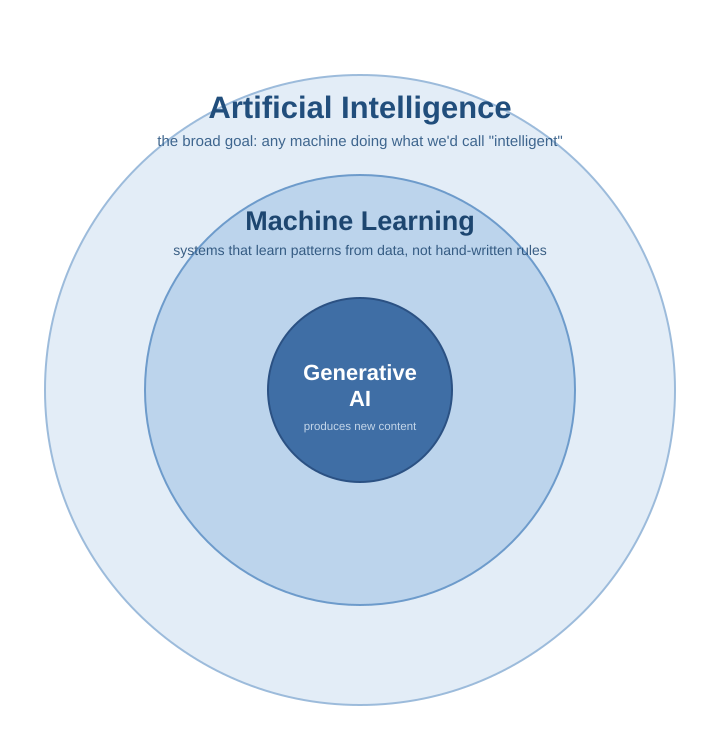
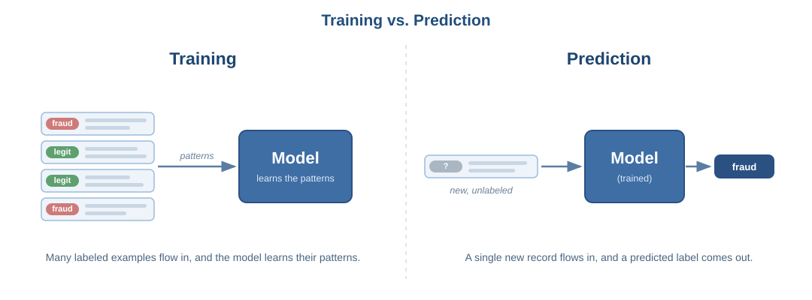

# Foundations: AI, Machine Learning, and Generative AI

## Why this matters

You are about to spend a lot of time working alongside AI coding tools. Before you can use them well - or reason about when they are likely to be wrong - it helps to know what is actually happening underneath. The goal of this document is not to turn you into a machine learning engineer. It is to give you a clear enough mental model that the rest of this module makes sense, and that you can hold an intelligent conversation about these systems with a client or a colleague.

By the end of this document you should be able to:

- Explain, in plain language, the difference between artificial intelligence, machine learning, and generative AI
- Describe how a machine learning model "learns" without being explicitly programmed
- Explain what makes generative AI different from the kind of AI that came before it
- Connect these concepts to the data engineering systems you will actually work on

These three terms - AI, ML, and generative AI - get used interchangeably in marketing and casual conversation. They are not the same thing. They nest inside each other, and seeing how they fit together is the foundation for everything else in this module.

---

## Artificial intelligence: the broad goal

**Artificial intelligence** is the broadest term. It refers to any technique that gets a computer to do something we would normally consider to require human intelligence: making a decision, recognizing a pattern, understanding language, playing a game.

Crucially, not all AI involves learning. Some of the earliest and still very common AI systems are just large sets of human-written rules. A thermostat that turns on the heat below a threshold is a trivial example. A data pipeline rule that says "if a record is missing a customer_id, send it to the error table; otherwise load it to the warehouse" is AI in this older, rules-based sense. A human wrote down every rule, and the system simply follows them.

This kind of system is predictable and easy to explain, which is exactly why it is still everywhere. Its limitation is also obvious: a human has to anticipate every situation in advance. The moment reality presents a case nobody wrote a rule for, the system has no idea what to do.

---

## Machine learning: learning from data instead of rules

**Machine learning (ML)** is a subset of AI, and it solves that limitation with a different approach. Instead of a human writing the rules, you show the system many examples and let it work out the patterns on its own.

The shift is worth pausing on, because it is the whole idea:

| Traditional programming | Machine learning |
|---|---|
| Human writes the rules | Human provides the examples |
| Rules + input produce the output | Examples produce the rules (the "model") |
| You know exactly why it did something | You often cannot fully explain a specific decision |
| Breaks on cases nobody anticipated | Generalizes to cases it never saw, sometimes wrongly |

Here is a concrete example from a world close to data engineering. Suppose you want to flag transactions that are likely fraudulent. Writing rules for this by hand is hopeless - fraud shows up in amounts, timing, location, merchant patterns, and device signals, in countless combinations, and the patterns shift as fraudsters adapt. With machine learning, you instead collect millions of past transactions that have already been labeled as "fraud" or "legitimate," and you let the model find the patterns that separate the two. You never tell it what fraud looks like. It learns that from the examples.

This process of showing examples is called **training**. The patterns the model extracts are stored in a set of internal numbers called **parameters** (you will also hear the word **weights**). Once trained, the model can take a brand new transaction it has never seen and make a prediction about it. That ability to handle new, unseen input is called **generalization**, and it is the entire point - a model that only worked on its training examples would be useless.

A few terms you will hear, briefly:

- **Supervised learning** - the training examples come with the right answers attached (transactions labeled "fraud" or "legitimate"). This is the most common setup in business applications.
- **Unsupervised learning** - the data has no labels, and the model groups or organizes it on its own (for example, discovering that your records naturally fall into several recurring clusters without anyone naming them in advance, which is useful for segmentation or anomaly detection).

You do not need to memorize the taxonomy. The thing to carry forward is the core idea: an ML model is a set of patterns learned from data, used to make predictions about new data.

---

## Generative AI: models that produce new content

For most of machine learning's history, models were built to **classify** or **predict** - to take an input and produce a label, a number, or a yes/no. Is this transaction fraudulent? Will this customer churn? Which category does this record belong to? The output is a decision about the input.

**Generative AI** is the newer branch that flips this around. Instead of producing a label about existing content, it produces brand new content: text, code, images, audio. You give it a prompt, and it generates something that did not exist before.

The way it does this is, at its heart, prediction - the same machine learning idea applied at enormous scale. A text-generating model has been trained on a vast amount of writing, and it has learned, statistically, what tends to come next given what came before. When you ask it to write a function or summarize a dataset, it is repeatedly predicting the next most-likely chunk of text, one piece at a time, until it has produced a full response. The next note in this module goes deeper into exactly how this works for the language models behind your coding tools.

This is why generative AI feels so different to use, and why it has a specific failure mode worth internalizing now:

> A generative model is optimized to produce output that is **plausible** - text that looks like a correct answer. It is not optimized to produce output that is **true**. Most of the time plausible and true line up. When they do not, the model will hand you a confident, well-formatted, completely wrong answer without any signal that something is off.

Holding both of these in your head at once - that these tools are genuinely powerful, and that their confidence is not evidence of correctness - is the single most important habit this module is trying to build. Everything about responsible use flows from it.

---

## Bringing it together in the modern data stack

These ideas are not abstract for the work you are heading into. A modern data platform uses all three layers at once:

- **Rules-based AI** still handles the deterministic work - data validation rules, scheduling and orchestration, routing malformed records to error tables. Predictable and auditable, which is exactly what you want for that job.
- **Machine learning** powers the predictive and inferential features - anomaly detection on incoming metrics, fraud scoring, entity resolution and deduplication, classifying records by category, and forecasting demand or volume for capacity planning.
- **Generative AI** powers the newest features - generating SQL from a plain-language question, drafting documentation for a dataset, summarizing data quality results, and the coding assistants you will use to build all of the above.

As a data engineer working on these systems, your value is not in competing with the models. It is in understanding the data and the domain well enough to know where each tool fits, and where it is likely to be wrong. A fraud model that quietly inherits a bias from skewed historical labels, an anomaly detector that performs worse on an underrepresented segment, a generated SQL query that silently drops rows because of a join it got subtly wrong - catching these requires exactly the foundational understanding you are building now. The rest of this module builds directly on top of it.
