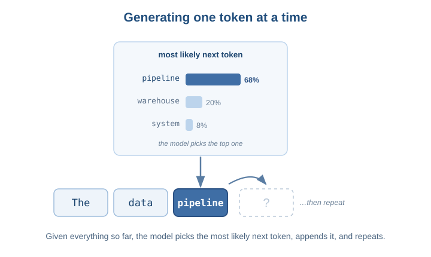
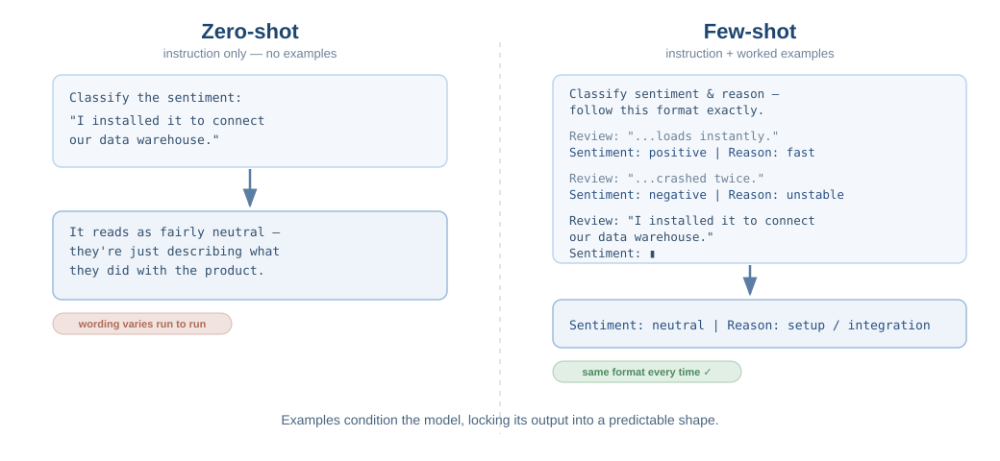
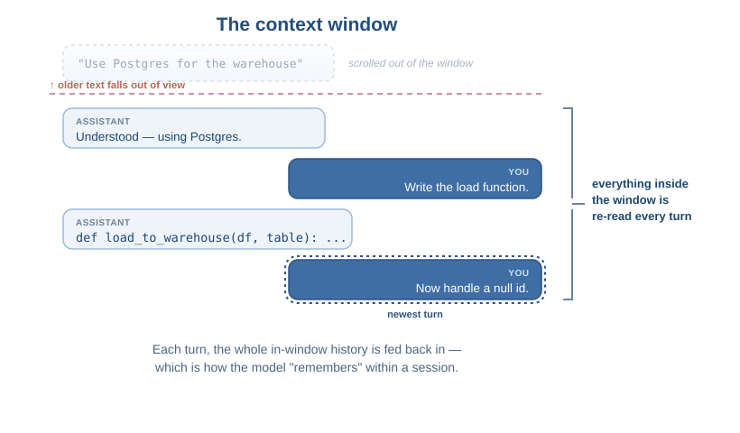

# Large Language Models and Prompt Engineering

## Why this matters

The previous notes explained generative AI in general terms. This document narrows the focus to the specific kind of generative model behind every coding assistant you will use: the **large language model**, or LLM. It also covers **prompt engineering** - the practical skill of getting useful, reliable output from these models.

These two topics belong together because they are two sides of the same coin. Understanding how an LLM works tells you *why* certain prompting techniques are effective, rather than leaving you to memorize tricks. The goal here is to build genuine intuition so that when a model gives you a poor answer, you have a mental model for why, and a sense of what to change.

By the end of this document you should be able to:

- Explain what a large language model is and how it generates text
- Recognize the major model families and what distinguishes them
- Describe realistic use cases and the boundaries of those use cases
- Apply core prompt engineering techniques (zero-shot and few-shot prompting, conditioning, and managing dialogue state)
- Distinguish between adjusting a model through prompting versus changing it through fine-tuning

---

## What a large language model is

A **large language model** is a generative model trained on an enormous body of text - books, articles, documentation, and vast quantities of source code - to do one deceptively simple thing: predict the next unit of text given everything that came before.

That unit is called a **token**. A token is roughly a word or a piece of a word; "pipeline" might be one token, while "unpartitioned" might break into "un," "partition," and "ed." The model reads your input as a sequence of tokens and generates its response one token at a time, each time asking "given everything so far, what is the most likely next token?" It appends that token and repeats. A full paragraph is just this loop running hundreds of times.



The word **large** is doing real work in the name. These models have billions of internal parameters and are trained on trillions of tokens. That scale is what allows them to produce fluent, context-aware text rather than gibberish. But notice what the model is fundamentally doing: it is producing statistically likely text, not retrieving verified facts. This is the same plausible-versus-true distinction from the previous notes, and it is the root of every hallucination you will encounter.

Two practical consequences follow directly from how LLMs work, and both will affect your daily use:

- **The training data has a cutoff.** The model knows nothing about events, library versions, or APIs that appeared after its training ended. It will still answer confidently about them, often by inventing something plausible.
- **The model has no memory between conversations and a limited window within one.** Everything it "knows" about your current task has to fit inside its **context window** - the amount of text it can consider at once. We will return to this when we discuss managing dialogue.

---

## The model families you will hear about

LLMs are not interchangeable. Different organizations have trained different families, with different strengths, licenses, and ways of being accessed. You do not need deep knowledge of each, but you should recognize the names and the broad distinctions.

| Family | Made by | Notes |
|---|---|---|
| **GPT** | OpenAI | The family behind ChatGPT. Closed model accessed through an API or web app. Strong general-purpose performance. |
| **Claude** | Anthropic | Known for strong coding ability, long context windows, and a focus on safety. Closed, API-accessed. The Claude Code tool you may encounter is built on this family. |
| **Gemini** | Google | Integrated across Google products and Cloud. Closed, API-accessed. |
| **Llama** | Meta | Notable for being **open weight** - the model can be downloaded and run on your own infrastructure rather than only through someone else's API. |
| **BERT** | Google | An older but still important family, built for a different job - understanding and classifying text rather than generating it. Often used under the hood for tasks like sentiment analysis. |

Two distinctions in that table are worth pulling out because they affect real decisions:

**Generative versus understanding models.** Most of the names above (GPT, Claude, Gemini, Llama) are built to *generate* text - they continue a sequence. BERT and its relatives are built to *understand* a complete piece of text and produce a classification or representation of it. When a data pipeline tags incoming support tickets by topic or scores the sentiment of product reviews, that is the kind of job a BERT-style model does well. When it drafts a plain-language summary of a dataset, that is a generative job. They are different tools for different problems.

**Closed versus open weight.** A closed model (GPT, Claude, Gemini) lives on the vendor's servers; you send your text to them and get a response back. An open-weight model (like Llama) can be downloaded and run inside your own environment. This is not a quality judgment - it is a data-control decision. If you are working with sensitive customer data and cannot send it to a third party, the ability to run a model entirely in-house can be the deciding factor. Keep this distinction in mind; it connects directly to the data handling concerns covered later in this module.

---

## Realistic use cases and their boundaries

LLMs are genuinely useful across a wide range of tasks. They are also confidently wrong often enough that every use case comes with a boundary. The pattern to internalize is that LLMs excel where the work is *language-shaped* and where you can verify the output, and they struggle where the work requires ground truth they do not have.

| Use case | Why it works | The boundary |
|---|---|---|
| Drafting and rewriting text | Pure language production - their core strength | You must check facts; it will state false things fluently |
| Summarizing long content | Condensing is a language task they do well | It can drop or invent a key detail; verify against the source |
| Explaining code or errors | It has seen enormous amounts of code and explanation | It may confidently explain code that does something subtly different |
| Generating code and tests | Code is highly patterned; it has seen millions of examples | It hallucinates methods and APIs; you must read, run, and test |
| Classifying or extracting | It can sort text by topic, tone, or intent | For high-volume, high-stakes classification a purpose-built model is often better and cheaper |

The throughline is the same in every row: the model produces a strong first draft, and you remain the source of truth. The deeper you go into this module, the more this turns from a slogan into a concrete working habit.

---

## Prompt engineering: getting the best output

**Prompt engineering** is the practice of structuring your input to get reliable, useful output. It is a real, learnable skill, and the reason it works is everything above: since the model generates the most likely continuation of whatever you give it, a clearer and more constrained input narrows the space of likely continuations toward what you actually want.

### Zero-shot prompting

**Zero-shot prompting** means asking the model to do something without giving it any examples of what a good answer looks like. You simply describe the task and let the model draw on its training.

```
Classify the sentiment of this product review as positive, negative, or neutral:
"The dashboard is fast, but the export feature crashes every time I use it."
```

This is the most common way people prompt, and for well-known tasks it works well. The model has seen countless sentiment classifications in training, so it does not need a demonstration. Zero-shot is your default - reach for it first, and add more structure only when the output disappoints.

### Few-shot prompting

When zero-shot output is inconsistent or you need a specific format, **few-shot prompting** helps. Here you include a small number of worked examples in the prompt before the real request. The examples *condition* the model by showing it the exact pattern you expect, and it continues that pattern.

```
Classify the sentiment and extract the reason. Follow this format exactly.

Review: "The dashboard loads instantly and the export feature is excellent."
Sentiment: positive | Reason: fast, useful feature

Review: "It crashed twice during setup and support never replied."
Sentiment: negative | Reason: instability, no support

Review: "I installed it to connect our data warehouse."
Sentiment:
```

The model now has a clear template and will almost always complete the last line in the same shape. Few-shot prompting is one of the most reliable ways to lock in a consistent output format without any change to the model itself. The trade-off is that examples consume space in the context window, so use as few as get the job done.



### Conditioning and Instructions

Both techniques above are forms of **conditioning** - shaping the model's behavior through the input you provide rather than by changing the model itself. Beyond examples, you condition a model by giving it explicit instructions, constraints, and a role to play. A few patterns that consistently improve results:

- **Give context, not just a request.** "Write a function to load some data" produces generic output. "Write a Python function `load_to_warehouse` that takes a pandas DataFrame and a table name, writes it to our Postgres warehouse using SQLAlchemy, and returns the number of rows written" produces something you can almost use directly.
- **State constraints up front.** "Use only the standard library, no external dependencies" prevents the model from reaching for things you do not have.
- **Set a role or audience.** "Explain this for a non-technical stakeholder in two sentences" produces a very different, and more useful, answer than the same question with no framing.

All of this is conditioning. You are not retraining anything; you are steering a fixed model with a well-shaped prompt. The applied coding patterns in the next notes are all built on these same ideas.

### Managing dialogue and context state

LLM conversations are **stateful within a session but stateless across sessions**. Within a single conversation, the model can see the earlier messages, so it appears to remember what you discussed. That memory is not magic - the whole conversation so far is being fed back into the model on every turn, which is what lets it stay coherent and build on prior answers.

This has direct, practical implications:

- **Iterate, do not restart.** If an answer is close but wrong, say specifically what to fix ("the method does not handle a null id - fix that"). The model has the prior context and will refine rather than start over.
- **Long conversations can drift.** Because the entire history is reconsidered each turn, a very long or muddled conversation can pull the model in a bad direction. When a thread has gone sideways, starting a fresh conversation often produces a cleaner result than fighting the accumulated context.
- **Mind the context window.** Everything has to fit in that finite window - your instructions, the conversation history, and any code you paste. In a long session, the earliest details can effectively fall out of view. If something important was established far back, restate it.



---

## Prompting versus fine-tuning

Everything covered so far - zero-shot, few-shot, conditioning, instructions - adjusts the model's behavior *at the moment you use it*, without changing the model. This is the right tool the overwhelming majority of the time, and it is where you should focus.

There is a heavier option you should be able to recognize and distinguish: **fine-tuning**. Fine-tuning takes an existing trained model and continues its training on a focused, specialized dataset, which actually changes the model's internal parameters. The result is a new version of the model that has internalized your domain's patterns.

The distinction in one line:

| Prompting / conditioning | Fine-tuning |
|---|---|
| Changes behavior through input only | Changes the model's actual parameters |
| Instant, free, reversible per request | Requires a dataset, compute, time, and cost |
| The model is unchanged | Produces a new, specialized model |
| Your first and usually only resort | Reserved for narrow, repeated, high-volume needs |

A useful way to hold the difference: prompting is giving clear instructions to a capable generalist for one task. Fine-tuning is sending that generalist to school to become a specialist. Most of your work, including everything in the rest of this module, lives entirely in the prompting world. Fine-tuning is something a team takes on deliberately when prompting has proven insufficient for a specific, recurring problem - not a routine step. Knowing the difference means you will recognize when someone proposes the heavier path, and can ask whether the lighter one was exhausted first.
