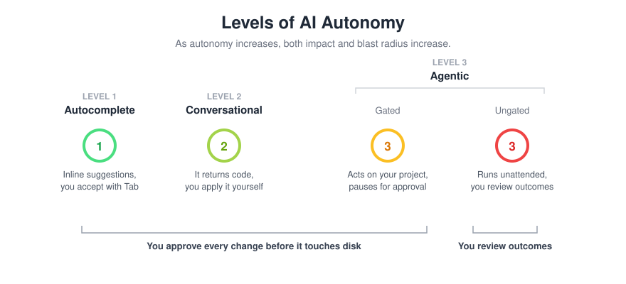

# Code Generation with GenAI

> The previous notes built the concepts: how LLMs generate text, and how to steer them with prompting. This document puts that to work in the place you will use it most - writing, understanding, and improving code. The vocabulary from those notes (zero-shot prompting, conditioning, context windows, hallucination) shows up here in applied form, so it is worth having them fresh.

## Working with AI is pair programming

It helps to frame what you are about to do correctly from the start. Using an AI coding tool is not like using a search engine, where you look something up and walk away with an answer. It is closer to **pair programming** - working alongside a partner on the same problem in real time.

In traditional pair programming, one person is the *driver*, typing and focused on the immediate code, while the other is the *navigator*, thinking about direction, correctness, and the bigger picture. When you work with an AI tool, the model is a fast, knowledgeable, occasionally overconfident driver. **You are always the navigator.** You set the direction, you decide what is worth keeping, and you are responsible for catching the moments where your partner is confidently heading the wrong way. The model can produce code far faster than you can type it, but it has no stake in whether that code is correct, appropriate for your system, or safe to ship. That judgment is yours, and it does not transfer.

Holding this framing changes how you use these tools. You stay engaged rather than passively accepting output, you ask questions rather than rubber-stamping, and you keep ownership of the result. The rest of this document is, in effect, about how to be a good navigator.

## LLMs Applied to Coding Environments

Every AI coding tool you'll encounter - Devin, GitHub Copilot, Claude Code, ChatGPT - is built on a **large language model**, so the mental model from the previous notes carries straight over. When you type a function signature and it fills in the body, the tool is not looking the answer up; it is predicting the most statistically probable continuation of the tokens so far.


Two consequences from those notes are the ones that bite once you are generating real code:

- The model's output is optimized to be **plausible**, not **true**. It can hand you confident, well-formatted, completely wrong code with no signal that anything is off.
- Its training data has a **cutoff**, so it knows nothing about library versions or APIs released after that point, and will invent something plausible rather than flag the gap.

Because of this, generating code with AI carries a standing obligation. This is the pair-programming framing from above turned into a checklist:

> **If you are generating code with AI, you must:**
> - **Read it** - understand what it's doing before you accept it
> - **Run it** - never assume it works because it looks right
> - **Test it** - cover the cases the model may not have considered
> - **Own it** - you are accountable for what you commit, not the tool that suggested it
>
> The professional skill is shifting from writing syntax to reviewing, testing, and catching hallucinations.

---

## Levels of AI Autonomy

The key variable across every AI coding tool is **autonomy** - how much the tool acts on your behalf versus waits for you to act. This spectrum matters because as autonomy increases, so does both potential impact and potential for unintended consequences.

It helps to think of these three levels as points on a dial rather than as separate categories of tool. In the early days each level tended to be a different product: one tool did autocomplete, another did chat, another ran autonomously. That is no longer true. A single modern tool, like GitHub Copilot, can sit at any of these levels depending on how you have configured it. The level is increasingly a setting you choose, not a property of the tool you installed. Learn the dial, and you will recognize where any tool, or any mode within a tool, is operating.

The boundary that matters most is between Level 2 and Level 3: it is the point where the tool stops handing you text to apply yourself and starts acting on your project directly. Level 3 - the agentic level - then has its own internal dial, from gated to fully unattended, which is where most of the real risk lives. Both of those are developed in detail below.



### Level 1 - Autocomplete

The model watches what you type and predicts what comes next, inline in the editor. You accept with Tab. Nothing happens until you decide.

- Works one suggestion at a time
- No file access beyond the currently open file (and nearby files for context)
- No autonomy - every token is gated by you
- **Examples:** GitHub Copilot autocomplete, Tabnine, Devin inline. Several of these tools also operate at higher levels; this is just their autocomplete behavior.

### Level 2 - Conversational

You describe what you want in a chat window and the model returns code or an explanation. You copy the output and apply it yourself. The defining feature is that the tool does not act on your project - you remain the bridge between its suggestion and your codebase. This is true even when the chat can see your open files: a panel that answers "what does this function do" or hands you a diff to paste is still Level 2 if *you* are the one applying it. The moment the tool starts writing files or running commands itself, you have crossed into Level 3.

- You describe the problem; it returns a suggestion
- May or may not have read access to your files; either way it takes no action on them
- You are the bridge between the suggestion and the codebase
- **Examples:** Claude.ai, ChatGPT, Gemini, and any in-editor chat used purely to ask and copy

### Level 3 - Agentic

The tool reads your project and acts on it directly through tools - writing files, running commands, calling APIs - and it runs in a loop: it observes the result of one action and decides the next without you scripting each move. This is the level where the tool, not you, does the applying. It is covered in depth in the next section; what matters here is that everything agentic lives at this one level.

- Reads your project and acts on your environment through tools
- Runs an observe-decide-act loop; the agent chooses each next step
- Has an internal dial for **how supervised that execution is**:
  - **Gated** - it pauses for your approval before each write or command. This is the **default state** of most modern agent tools, and where day-to-day agentic work happens.
  - **Ungated (unattended)** - the same loop runs without pausing; it reads, writes, and runs on its own, and you review the outcome rather than each step.

The gated/ungated setting lives in configuration, not in your prompt. In VS Code, an agent that pauses to ask "apply this edit?" or "run this command?" is gated Level 3; removing that gate makes it ungated Level 3. It is the same agent either way.

> **Where you'll spend most of your time, and the one line to watch**  
> Levels 1, 2, and *gated* Level 3 are where daily AI-assisted development happens: the feedback loop is fast and you approve every change before it touches disk. The single most important boundary in this whole document is the gate inside Level 3 - the move from gated to ungated. That is where you stop reviewing each action and start reviewing only outcomes, and where the blast radius grows. Treat crossing it as a deliberate decision, not a default.

---

## More on Agentic AI

"Agentic" has become marketing shorthand for "does more stuff," which obscures the real distinction. The precise definition: **a system is agentic when it uses tools and decides its own next step in a loop - observing the result of one action and choosing the next without you scripting each move.** Two properties are required:

1. **Tool use** - it can read and write files, run shell commands, call APIs, execute code
2. **An iterative loop** - it chooses what to do next based on what it just observed, rather than producing one answer and stopping

What is *not* in that definition is whether it asks permission. The gate sits on the *execution* of side-effecting actions, not on the decision-making, so a gated agent is every bit as agentic as an unattended one. An agent that reads ten files, writes three, runs your test suite, observes the failures, and edits the implementation is running this loop whether or not it pauses for approval along the way.


### Why the gate matters

The gated/ungated dial is the single most consequential setting in agentic work. It does not change what the agent is - same loop, same tools - only how much you see before changes hit disk.

| Gated | Ungated (unattended) |
|---|---|
| Pauses before each write or command | Executes writes and commands without pausing |
| You approve each action as it happens | You review the outcome after the fact |
| Limited blast radius | Can modify many files before you see anything |
| Day-to-day default | A deliberate choice for low-risk, well-scoped work |

Ungated, an agent can modify code across dozens of files and run commands with real side effects before you ever see a summary. Passing tests are not a substitute for reading the diff - the agent may have taken a path you wouldn't have chosen or introduced technical debt you didn't intend.

> Before turning an agent loose ungated on a real project: commit your current state to git first. Use git to revert the agents work.

The terminal agents you'll meet professionally - Claude Code, Codex CLI, Gemini CLI, Copilot CLI - are all agentic and all run ungated by default. They are listed alongside the editor tools in the landscape table below.

---

## GitHub Copilot

GitHub Copilot is the default tool for this cohort, and the one you are most likely to meet in a professional setting - it is the market leader and integrates tightly with the GitHub and Microsoft ecosystem most companies already use. It is a paid tool, with a free tier for students and verified open-source maintainers, and it lives directly inside your existing editor - VS Code, JetBrains IDEs, Visual Studio - rather than asking you to switch editors. It covers different levels of autonomy, from autocomplete through agentic work, gated or ungated.

**Install:**
- VS Code - install the "GitHub Copilot" and "GitHub Copilot Chat" extensions from the marketplace
- JetBrains IDEs - search "GitHub Copilot" in the plugin marketplace
- Sign in with your GitHub account; if you qualify for the free tier, enable it from your GitHub account settings

**What the free tier actually gets you:** Copilot Free (available to any individual GitHub account, with the metered caps waived entirely for verified students and open-source maintainers) caps you at **2,000 code completions and 50 chat requests per month**. The completions are the inline Tab suggestions; the 50 chat requests cover Copilot Chat and agent-mode turns, and they are the limit you actually feel - one agent task can burn several requests, so 50 goes fast. Access to the premium models (the stronger reasoning models behind agent mode) is not part of the free tier. As a rule of thumb, the free tier comfortably covers light, exploratory use - a few hours a week, autocomplete plus the occasional chat - but a single day of heavy agent-driven work will exhaust the monthly chat allowance. For sustained daily use you would need Copilot Pro (a paid plan, free for verified students). Note that as of June 1, 2026 GitHub moved its paid plans to usage-based billing, so paid limits are now metered by token consumption rather than a fixed request count - check the current terms at the source before relying on any specific number.

---

## The wider tool landscape

| Tool | Levels it covers | What to know |
|---|---|---|
| **GitHub Copilot** | 1–3 | This cohort's default and the most widely deployed assistant in industry. Its Level 3 runs gated by default; the gated/ungated dial is a setting, not a different product. Free tier for students and verified open-source maintainers. |
| **Copilot CLI** | 3 | GitHub's terminal agent, the command-line counterpart to in-editor Copilot. Asks for approval by default; goes unattended via autopilot mode (`--allow-all` / `--yolo`). |
| **Devin (previously Windsurf)** | 1, 3 (gated) | A free alternative (no payment info required) if you cannot use Copilot. Same rhythm: autocomplete plus an in-editor agent called Cascade. |
| **Cursor** | 1, 2, 3 | A standalone editor (a fork of VS Code) built around AI. Strong multi-file editing. |
| **Claude Code** | 3 | Anthropic's terminal agent. Reads, writes, and runs commands; asks for approval by default, and runs ungated with `--dangerously-skip-permissions` (or the looser acceptEdits / Auto modes). |
| **Tabnine** | 1 | Autocomplete-focused, with an emphasis on running privately for teams with strict data rules. |
 
If you can use Copilot well, you can use any of these well. The rhythm - accepting suggestions, giving the tool real project context, and reviewing diffs before accepting - transfers completely; only the keybindings and the billing change.

---

## Responsible Use

Three principles apply every time you open a code generation tool.

### 1. Verify everything

AI-generated code is a first draft, not a solution. The Read it / Run it / Test it / Own it obligation from the top of these notes applies to every line you accept.

### 2. Know what you're sending

When you use an AI coding tool, your prompt and code context are sent to a remote server for processing. The questions worth asking are: where does it go, how long is it kept, and does it get used to train future models.

**GitHub Copilot:** Your prompts and the surrounding code context are sent to GitHub and Microsoft's servers for processing. Under the Business and Enterprise tiers, your code is contractually excluded from being used to train their models; the individual tiers have a setting that controls whether your snippets can be used for product improvement. Check which tier you are on and how it is configured. Chat sends broader project context than autocomplete does.

**Some tools do train on your code.** Free tiers in particular often reserve the right to use conversations and code context to improve the model. Code you paste into a free chat interface may end up influencing future model outputs.

**The hard rule:** API keys, database credentials, passwords, and customer data never belong in a prompt - on any tool, on any tier. There is no safe way to paste a credential into a chat window and assume it stays private.

```
# Do not do this
"My connection string is postgresql://prod-db:5432/analytics?password=abc123.
Why is my connection pool exhausting?"

# Do this instead
"Help me debug connection pool exhaustion in a Python service using SQLAlchemy.

Here is the relevant config and stack trace: [sanitized]"
```

For proprietary code more broadly, check the data handling policy for your specific tier before using any tool with client code or internal systems. Free is not the same as enterprise in terms of data retention. When in doubt, describe the problem in general terms rather than pasting the code directly. Policies change, check them at the source.

### 3. You are still the engineer

AI tools shift where the work happens - from writing syntax to reviewing, debugging, and architectural thinking - but they do not remove accountability. If code you accepted causes a production incident, the post-mortem does not note "the AI wrote it." You reviewed it and committed it.

---

## Prompting, applied to code

The prompting notes covered the core ideas - conditioning a model with context, constraints, and a role, and iterating within a conversation rather than restarting. None of that changes when the output is code; you are simply applying the same techniques to a coding task. What follows is those ideas in their applied, code-specific form.

### Give context, not just a request

This is **conditioning** from the prompting notes: the more specific the input, the narrower the space of likely continuations. For code, "specific" usually means naming the language, the library, the return type, and the edge cases.

| Less effective | More effective |
|---|---|
| `"Write a function to get a record by ID"` | `"Write a Python function get_order_by_id using SQLAlchemy. Return the Order row or None if not found. The orders table has an integer id column."` |
| `"Fix this error"` + stack trace | `"I'm getting a SettingWithCopyWarning in my transform_orders function when I assign to a filtered DataFrame slice. Here's the stack trace and the relevant function."` |
| `"Write tests for this function"` | `"Write pytest unit tests for transform_orders. Use a small in-memory DataFrame as the fixture. Cover: clean input, rows with null order_id, and an empty DataFrame."` |

### Common prompting patterns

**Constrain the environment**  
`"Use only the standard library, and target Python 3.11 with pandas 2.x."` - keeps the model from reaching for libraries you don't have or APIs that don't match your stack.

**Provide the signature, get the body**  
Give the model your method signature and let it fill in the implementation. This locks in your design choices.

**Ask for explanation before modification**  
`"Explain what this code does before you change it."` - catches misunderstandings early, before they become wrong code.

**Specify error handling explicitly**  
`"Raise a ValueError if the input DataFrame is empty."` - otherwise the model may return None, throw a generic exception, or silently swallow the error.

**Request tests alongside code**  
`"Write the implementation and a unit test for it."` - forces the model to reason about edge cases.

### Iterating on output

The "iterate, don't restart" guidance from the prompting notes applies directly here: when a generated function is close but wrong, tell the model specifically what to fix (`"this doesn't handle the case where userId is null - fix that"`) rather than starting over, and open a fresh conversation when a long thread has drifted somewhere unhelpful.


---

## More Use Cases

The same principles apply across everything you'll use AI for in development. Give it specific context, get specific output, verify before you use it.

### Writing tests

AI is genuinely strong here - tests are structured, follow predictable patterns, and don't require the model to understand your business logic deeply.

Watch out for tests that pass but don't assert the right thing, and missing edge cases specific to your domain.

**Signature-first:** Give it the function signature and what it should cover. Let it generate the structure, then verify the assertions.
> *"Write pytest unit tests for this function. Use a small in-memory DataFrame fixture. Cover: clean input, rows with missing values, and an empty DataFrame. Here is the function signature: [paste signature]"*

**Test the gaps:** Paste an existing test module and ask what's missing.
> *"Here is my test module for transform_orders. What cases am I not testing? Suggest the missing test functions without writing them yet."*

### Documentation

AI saves the most tedious time here. Watch out for generic comments that describe syntax rather than intent - "this method returns a user" is not documentation.

**Intent-first:** Tell it what the function is *for*, not just what it does.
> *"Add a docstring to this function. The intent is to deduplicate customer records by matching on email and keeping the most recently updated row. Emphasize what happens when timestamps are missing."*

**Audience-aware summary:** Useful when you need to explain something to a non-technical stakeholder.
> *"Summarize what this ingestion pipeline does in 2–3 sentences for a non-technical stakeholder. Avoid implementation details."*

### Code analysis

AI is a fast second set of eyes - useful for gut-checks before you hand something off. It will not replace static analysis tools or a real code review, and it tends to focus on style over logic bugs.

**Focused review:** Broad prompts get broad answers. Ask for something specific.
> *"Review this transformation function for unhandled None values and edge cases that could break on empty or malformed input. Don't comment on style."*

**Explain before you change:** When inheriting unfamiliar code, ask it to explain before you touch anything.
> *"Explain what this module does and identify any parts that look fragile or worth understanding before modifying."*

### Optimization

Most useful for targeted improvements. The model optimizes for what it can see - it doesn't know where your app is actually slow.

Watch out for premature optimization suggestions and "optimizations" that subtly change behavior.

**Describe the constraint:** Tell it what you're trying to improve and why.
> *"This function runs for every row in the batch and queries the database inside a loop. Suggest how to restructure it to reduce database calls, ideally to a single bulk query."*

**Readability over performance:** Optimization isn't only about speed.
> *"Refactor this function to be more readable. Keep the behavior identical. Prefer named variables and clear intent over brevity."*


### Things to watch for

- **Hallucinated method names** - the model may call a method that doesn't exist in your version of a library
- **Outdated API usage** - training data has a cutoff; newer APIs may be used incorrectly
- **Missing imports** - generated code frequently assumes imports that aren't present
- **Wrong assumptions about your schema** - always verify generated queries against your actual data model
- **Overly complex solutions** - the model sometimes generates more abstraction than the problem requires; simpler is usually better
