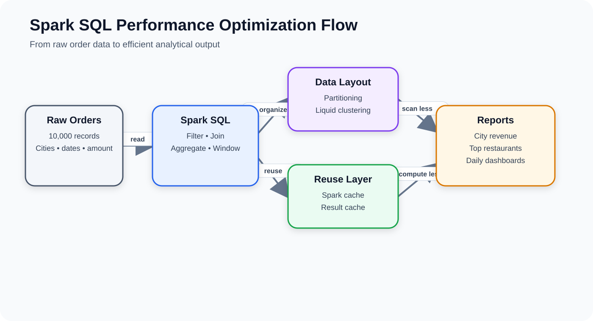
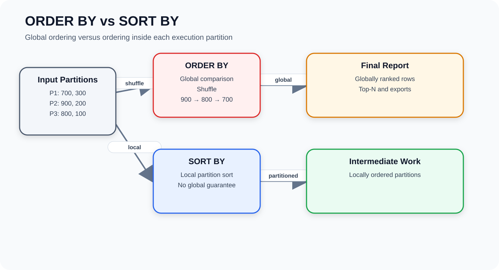
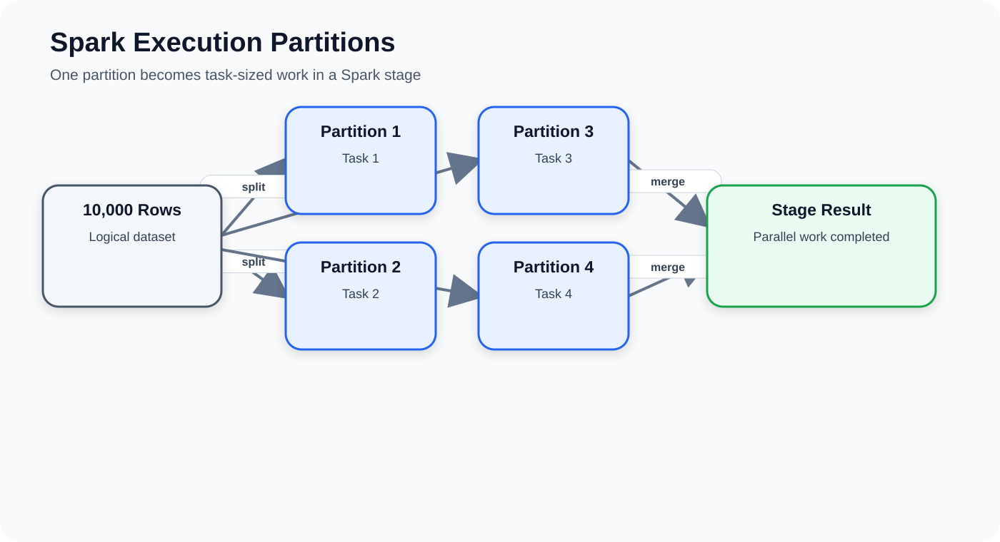
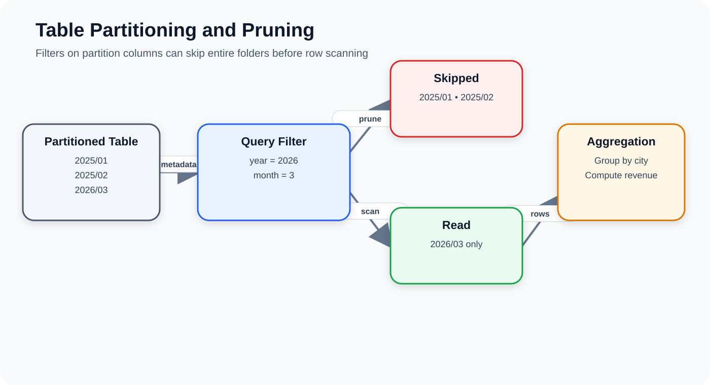
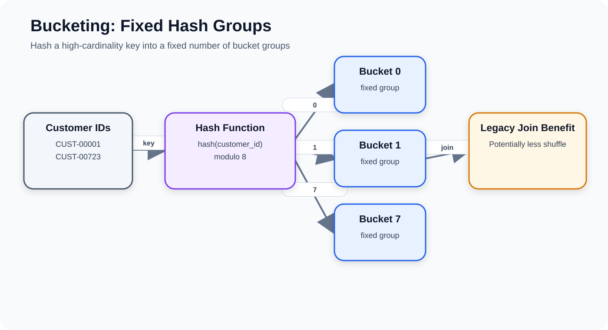
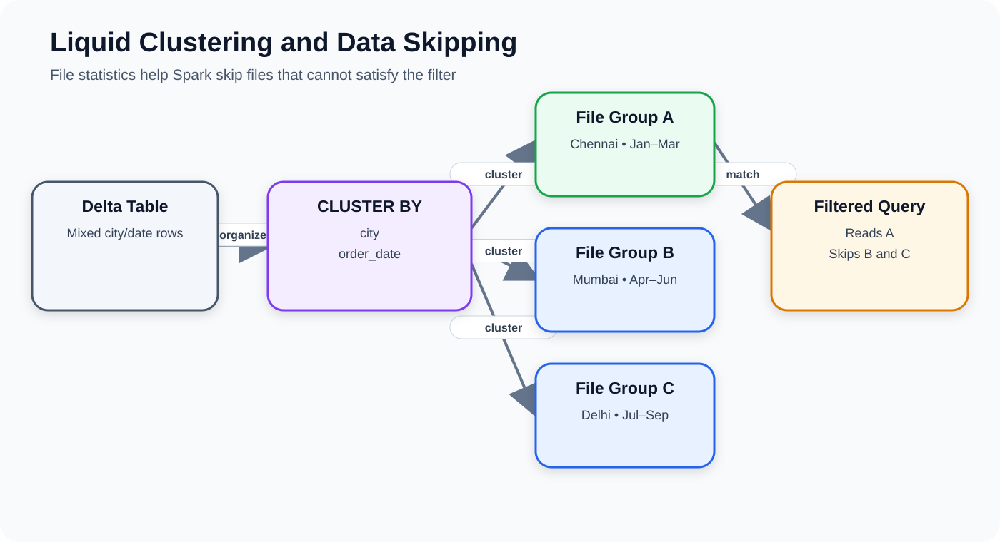
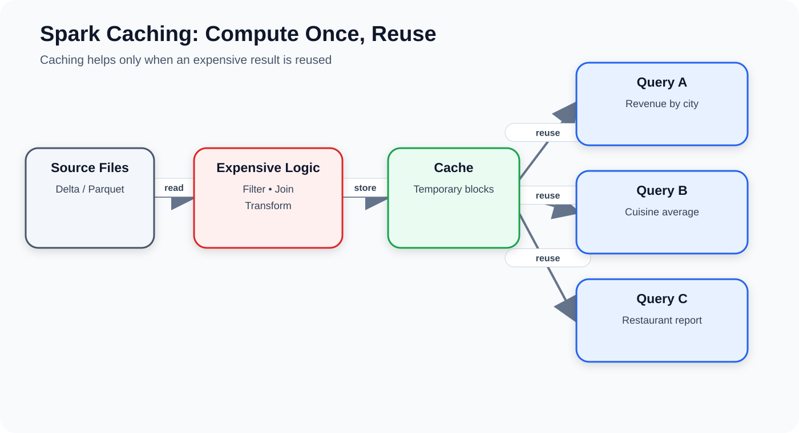
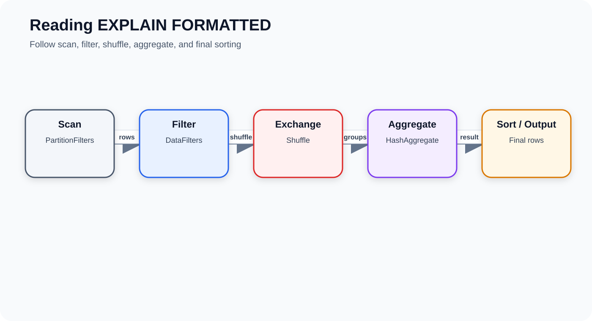
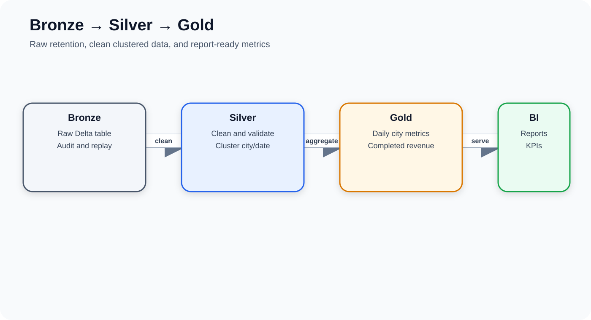

# Spark SQL Performance Concepts in Databricks Free Edition

> **Topics:** Sorting, execution partitioning, table partitioning, bucketing, liquid clustering, caching, and query-plan analysis  
> **Scenario:** Online food-delivery order analytics  
> **Level:** Fresher to intermediate



---

## 1. Learning outcomes

By the end, you can explain and implement:

- `ORDER BY`, `SORT BY`, `DISTRIBUTE BY`, and query-level `CLUSTER BY`
- Spark execution partitions, table partitions, and window partitions
- Partition pruning and the small-files risk
- Traditional bucketing and its legacy use
- Liquid clustering and Delta data skipping
- Selective Spark caching
- `EXPLAIN FORMATTED`
- A Bronze–Silver–Gold workflow

---

## 2. Databricks Free Edition setup

1. Open **Workspace**.
2. Choose **Create → Notebook**.
3. Name it `Spark_SQL_Performance_Optimization`.
4. Select **SQL** as the default language.
5. Attach the available serverless compute.

Language switches:

```text
%sql
```

```text
%python
```

> Serverless behavior can differ from a classic cluster. Features such as explicit cache and `OPTIMIZE` can depend on workspace capability and runtime support.

---

## 3. Create the schema

```sql
CREATE SCHEMA IF NOT EXISTS workspace.spark_sql_performance;

USE CATALOG workspace;
USE SCHEMA spark_sql_performance;
```

When names differ:

```sql
SHOW CATALOGS;
SHOW SCHEMAS;
```

---

## 4. Create 10,000 food-delivery orders

```sql
CREATE OR REPLACE TABLE food_delivery_orders
USING DELTA
AS
SELECT
    id AS order_id,

    CONCAT('CUST-', LPAD(CAST((id % 1200) + 1 AS STRING), 5, '0'))
        AS customer_id,

    CONCAT('REST-', LPAD(CAST((id % 120) + 1 AS STRING), 4, '0'))
        AS restaurant_id,

    CASE id % 6
        WHEN 0 THEN 'Chennai'
        WHEN 1 THEN 'Bengaluru'
        WHEN 2 THEN 'Hyderabad'
        WHEN 3 THEN 'Mumbai'
        WHEN 4 THEN 'Delhi'
        ELSE 'Kochi'
    END AS city,

    CASE id % 5
        WHEN 0 THEN 'South Indian'
        WHEN 1 THEN 'North Indian'
        WHEN 2 THEN 'Chinese'
        WHEN 3 THEN 'Fast Food'
        ELSE 'Biryani'
    END AS cuisine,

    CASE id % 4
        WHEN 0 THEN 'COMPLETED'
        WHEN 1 THEN 'COMPLETED'
        WHEN 2 THEN 'CANCELLED'
        ELSE 'IN_PROGRESS'
    END AS order_status,

    ROUND(150 + ((id * 17) % 850), 2) AS order_amount,
    ROUND(20 + ((id * 7) % 80), 2) AS delivery_fee,

    DATE_ADD(DATE '2025-01-01', CAST(id % 540 AS INT))
        AS order_date,

    TIMESTAMPADD(
        HOUR,
        CAST(id % 24 AS INT),
        TIMESTAMP(DATE_ADD(DATE '2025-01-01', CAST(id % 540 AS INT)))
    ) AS order_timestamp

FROM RANGE(1, 10001);
```

Validate:

```sql
SELECT * FROM food_delivery_orders LIMIT 10;
SELECT COUNT(*) AS total_orders FROM food_delivery_orders;
```

Expected count:

```text
10000
```

---

## 5. Sorting



| Clause | Purpose | Global order? | Main cost |
|---|---|---:|---|
| `ORDER BY` | Sort complete output | Yes | Global shuffle and comparison |
| `SORT BY` | Sort within each execution partition | No | Local partition sorting |
| `DISTRIBUTE BY` | Redistribute matching keys | No | Shuffle |
| Query `CLUSTER BY` | Redistribute and locally sort | No | Shuffle plus local sort |

### 5.1 `ORDER BY`

```sql
SELECT order_id, city, order_amount
FROM food_delivery_orders
ORDER BY order_amount DESC
LIMIT 10;
```

Use it for final reports, Top-N output, ranked exports, and presentation-ready results.

### 5.2 Multiple columns

```sql
SELECT city, order_date, order_amount
FROM food_delivery_orders
ORDER BY city ASC, order_amount DESC;
```

### 5.3 Null placement

```sql
SELECT order_id, city, order_amount
FROM food_delivery_orders
ORDER BY order_amount DESC NULLS LAST;
```

### 5.4 `SORT BY`

```sql
SELECT order_id, city, order_amount
FROM food_delivery_orders
SORT BY order_amount DESC;
```

Every partition is sorted independently. The combined result is not globally ordered.

---

## 6. Spark execution partitions



An execution partition is a logical data block handled by one Spark task in a stage.

It affects:

- Parallelism
- Task count
- Shuffle overhead
- Memory use
- Output file count

Optional Python inspection:

```python
orders_df = spark.table("food_delivery_orders")
orders_df.rdd.getNumPartitions()
```

Repartition by city:

```python
city_partitioned_df = orders_df.repartition("city")
```

Reduce partitions:

```python
smaller_df = orders_df.coalesce(2)
```

| Method | Increase partitions? | Normal shuffle? | Use |
|---|---:|---:|---|
| `repartition()` | Yes | Yes | Redistribute data |
| `coalesce()` | Usually reduce only | No full shuffle | Reduce output partitions |

---

## 7. Three meanings of partition

### Execution partition
A temporary unit of parallel task work.

### Table partition
A permanent value-based storage layout such as:

```text
order_year=2026/order_month=3/
```

### Window partition
A calculation group:

```sql
SELECT
    city,
    order_id,
    order_amount,
    ROW_NUMBER() OVER (
        PARTITION BY city
        ORDER BY order_amount DESC
    ) AS city_order_rank
FROM food_delivery_orders;
```

Window `PARTITION BY` does not physically reorganize the table.

---

## 8. `DISTRIBUTE BY`

```sql
SELECT order_id, city, order_amount
FROM food_delivery_orders
DISTRIBUTE BY city;
```

Flow:

```text
Hash city → Shuffle rows → Consistently place matching city values
```

It does not guarantee one city per partition, one partition per city, sorted rows, or permanent storage.

---

## 9. Query-level `CLUSTER BY`

```sql
SELECT order_id, city, order_amount
FROM food_delivery_orders
CLUSTER BY city;
```

This is logically similar to:

```sql
DISTRIBUTE BY city
SORT BY city
```

Do not confuse it with table-level clustering:

```sql
CREATE TABLE example
USING DELTA
CLUSTER BY (city);
```

---

## 10. Traditional table partitioning



```sql
CREATE OR REPLACE TABLE food_orders_partitioned
USING DELTA
PARTITIONED BY (order_year, order_month)
AS
SELECT
    order_id,
    customer_id,
    restaurant_id,
    city,
    cuisine,
    order_status,
    order_amount,
    delivery_fee,
    order_date,
    order_timestamp,
    YEAR(order_date) AS order_year,
    MONTH(order_date) AS order_month
FROM food_delivery_orders;
```

Query with pruning:

```sql
SELECT
    city,
    COUNT(*) AS total_orders,
    ROUND(SUM(order_amount), 2) AS total_order_value
FROM food_orders_partitioned
WHERE order_year = 2026
  AND order_month = 3
GROUP BY city
ORDER BY total_order_value DESC;
```

Good partition columns have low/moderate cardinality, frequent filters, balanced values, and enough rows per partition.

Avoid:

```text
order_id
customer_id
transaction_id
email_address
timestamp
```

These can create many tiny folders and files.

---

## 11. Bucketing



Formula:

```text
bucket_number = hash(column_value) modulo bucket_count
```

Traditional syntax:

```sql
CREATE TABLE old_style_bucketed_orders (
    order_id BIGINT,
    customer_id STRING,
    city STRING,
    order_amount DOUBLE
)
USING PARQUET
CLUSTERED BY (customer_id)
INTO 8 BUCKETS;
```

| Partitioning | Bucketing |
|---|---|
| Actual column values | Hash values |
| Value-based folders | Fixed number of groups |
| Good for low/moderate cardinality | Can accept high-cardinality keys |
| Supports pruning | Historically helped compatible joins |

For modern Delta workloads, bucketing is mainly a legacy concept rather than the default design.

---

## 12. Liquid clustering



Create the table:

```sql
CREATE OR REPLACE TABLE food_orders_clustered
USING DELTA
CLUSTER BY (city, order_date)
AS
SELECT *
FROM food_delivery_orders;
```

Inspect:

```sql
SHOW CREATE TABLE food_orders_clustered;
DESCRIBE DETAIL food_orders_clustered;
```

Filter:

```sql
SELECT
    restaurant_id,
    COUNT(*) AS completed_orders,
    ROUND(SUM(order_amount), 2) AS revenue
FROM food_orders_clustered
WHERE city = 'Chennai'
  AND order_date BETWEEN DATE '2026-01-01' AND DATE '2026-03-31'
  AND order_status = 'COMPLETED'
GROUP BY restaurant_id
ORDER BY revenue DESC
LIMIT 10;
```

Spark can use Delta file statistics to skip files that cannot contain matching city/date values.

When available:

```sql
OPTIMIZE food_orders_clustered;
DESCRIBE HISTORY food_orders_clustered;
```

Change clustering columns:

```sql
ALTER TABLE food_orders_clustered
CLUSTER BY (restaurant_id, order_date);
```

Choose columns used frequently in `WHERE`, `JOIN`, and `GROUP BY`.

---

## 13. Spark caching



Without caching, repeated queries can repeat file reads and transformations. With caching, the first action materializes reusable blocks.

Cache a table:

```sql
CACHE TABLE food_delivery_orders;
SELECT COUNT(*) FROM food_delivery_orders;
```

Reuse it:

```sql
SELECT city, COUNT(*) AS total_orders
FROM food_delivery_orders
GROUP BY city
ORDER BY total_orders DESC;
```

Cache a filtered result:

```sql
CACHE TABLE completed_orders_cache AS
SELECT
    order_id,
    customer_id,
    restaurant_id,
    city,
    cuisine,
    order_amount,
    delivery_fee,
    order_date
FROM food_delivery_orders
WHERE order_status = 'COMPLETED';
```

Check with Python:

```python
spark.catalog.isCached("food_delivery_orders")
spark.catalog.isCached("completed_orders_cache")
```

Remove:

```sql
UNCACHE TABLE food_delivery_orders;
UNCACHE TABLE completed_orders_cache;
CLEAR CACHE;
```

Cache is temporary and can disappear after session termination, compute recycling, or memory pressure.

---

## 14. `EXPLAIN FORMATTED`



```sql
EXPLAIN FORMATTED
SELECT
    city,
    COUNT(*) AS completed_orders,
    SUM(order_amount) AS revenue
FROM food_orders_clustered
WHERE city IN ('Chennai', 'Bengaluru')
  AND order_status = 'COMPLETED'
GROUP BY city;
```

Look for:

| Plan term | Meaning |
|---|---|
| `Scan` | File reading |
| `Filter` | Row removal |
| `Exchange` | Shuffle |
| `Sort` | Sorting |
| `HashAggregate` | Grouped aggregation |
| `BroadcastHashJoin` | Broadcast small table |
| `PartitionFilters` | Partition pruning |
| `DataFilters` | Row-level filters |

Compare:

```sql
EXPLAIN FORMATTED
SELECT city, order_id, order_amount
FROM food_delivery_orders
ORDER BY order_amount DESC;
```

```sql
EXPLAIN FORMATTED
SELECT city, order_id, order_amount
FROM food_delivery_orders
SORT BY order_amount DESC;
```

---

## 15. Top three completed orders per city

```sql
WITH ranked_orders AS (
    SELECT
        order_id,
        city,
        restaurant_id,
        order_amount,
        DENSE_RANK() OVER (
            PARTITION BY city
            ORDER BY order_amount DESC
        ) AS amount_rank
    FROM food_delivery_orders
    WHERE order_status = 'COMPLETED'
)
SELECT *
FROM ranked_orders
WHERE amount_rank <= 3
ORDER BY city, amount_rank;
```

---

## 16. Bronze–Silver–Gold workflow



Bronze:

```sql
CREATE OR REPLACE TABLE bronze_food_orders
USING DELTA
AS
SELECT * FROM food_delivery_orders;
```

Silver:

```sql
CREATE OR REPLACE TABLE silver_food_orders
USING DELTA
CLUSTER BY (city, order_date)
AS
SELECT
    order_id,
    customer_id,
    restaurant_id,
    TRIM(city) AS city,
    TRIM(cuisine) AS cuisine,
    UPPER(order_status) AS order_status,
    order_amount,
    delivery_fee,
    order_amount + delivery_fee AS customer_total,
    order_date,
    order_timestamp
FROM bronze_food_orders
WHERE order_id IS NOT NULL
  AND order_amount >= 0;
```

Gold:

```sql
CREATE OR REPLACE TABLE gold_daily_city_sales
USING DELTA
CLUSTER BY (city, order_date)
AS
SELECT
    order_date,
    city,
    COUNT(*) AS total_orders,
    SUM(CASE WHEN order_status = 'COMPLETED' THEN 1 ELSE 0 END)
        AS completed_orders,
    ROUND(
        SUM(CASE WHEN order_status = 'COMPLETED' THEN order_amount ELSE 0 END),
        2
    ) AS completed_revenue,
    ROUND(AVG(order_amount), 2) AS average_order_amount
FROM silver_food_orders
GROUP BY order_date, city;
```

Query:

```sql
SELECT *
FROM gold_daily_city_sales
WHERE city = 'Chennai'
ORDER BY order_date DESC
LIMIT 30;
```

---

## 17. Recommended strategy

- Use `ORDER BY` only when global output order is required.
- Use execution repartitioning only when downstream work benefits.
- Use table partitioning only after proving pruning value.
- Learn bucketing for legacy Spark systems.
- Prefer liquid clustering as a starting point for modern Delta data.
- Cache only expensive results reused multiple times.
- Verify every optimization using `EXPLAIN FORMATTED`.

---

## 18. Common mistakes

1. Assuming `ORDER BY` changes table storage.
2. Confusing query-level and table-level `CLUSTER BY`.
3. Partitioning by unique IDs.
4. Treating cache as permanent.
5. Caching a dataset used only once.
6. Claiming an optimization without checking the physical plan.

---

## 19. Cleanup

```sql
CLEAR CACHE;

DROP TABLE IF EXISTS gold_daily_city_sales;
DROP TABLE IF EXISTS silver_food_orders;
DROP TABLE IF EXISTS bronze_food_orders;
DROP TABLE IF EXISTS completed_orders;
DROP TABLE IF EXISTS food_orders_clustered;
DROP TABLE IF EXISTS food_orders_partitioned;
DROP TABLE IF EXISTS food_delivery_orders;

DROP VIEW IF EXISTS completed_orders_view;
DROP VIEW IF EXISTS completed_orders_cache;
```

Optional:

```sql
USE SCHEMA default;
DROP SCHEMA IF EXISTS workspace.spark_sql_performance CASCADE;
```

---

## 20. Final comparison

| Concept | Purpose | Permanent? | Recommendation |
|---|---|---:|---|
| `ORDER BY` | Global output sorting | No | When required |
| `SORT BY` | Partition-local sorting | No | Selectively |
| `DISTRIBUTE BY` | Redistribute matching keys | No | Selectively |
| Query `CLUSTER BY` | Redistribute and locally sort | No | Selectively |
| Table partitioning | Value-based physical layout | Yes | Only when proven |
| Bucketing | Fixed hash groups | Yes | Mostly legacy |
| Liquid clustering | Flexible Delta organization | Yes | Preferred |
| Spark cache | Reuse computed data | No | Selectively |

---

## Opening the document

Keep the Markdown file and `images` folder together.

```text
spark_sql_visual_notes_final/
├── spark_sql_performance_visual_notes.md
├── README.md
└── images/
```

In VS Code, open the MD file and press **Ctrl+Shift+V**. All diagrams use relative paths and appear directly inside the preview.
